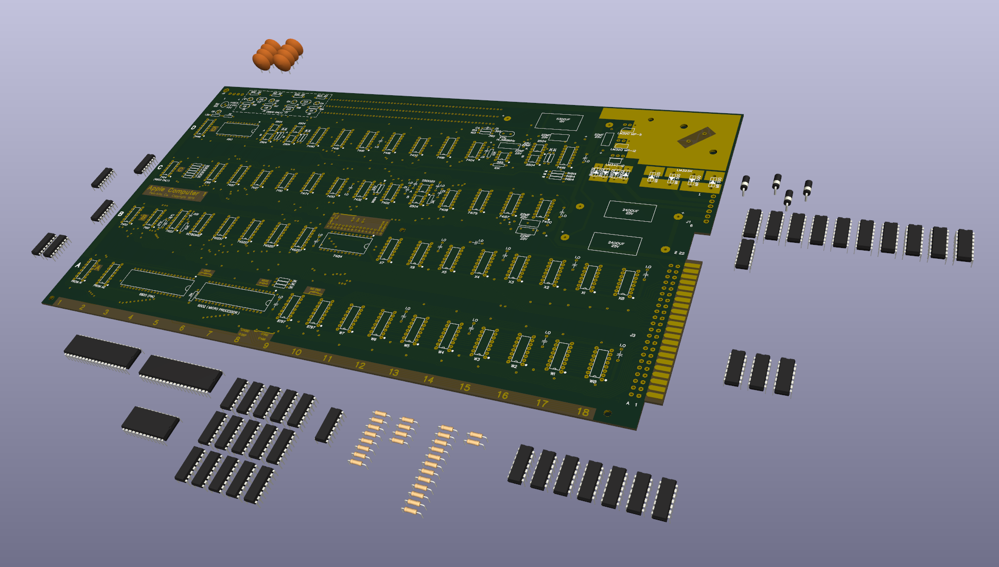

# About
This project is mainly to rebuild the Apple-1 Computer as a complete KiCad project from Schematic to 3D Board. There currently exists a set of schematics, and gerber files for the boards, but this project is attempting to marry the two together, such that there is an interactive and feature complete PCB file with proper footprints linked to the schematic.

There are a lot of passionate hobbyists out there trying to preserve the original computer as it was originally designed, and that is what interests me. While stripped down or altered replicas are cool, what interests me the most is the original thing, unaltered in its original state with the original schematics and components. 

## Contributing

If you'd like to contribute, I'm always happy to accept work on the kicad files, additional documents, programs, what have you. Footprint creation, pin mapping, and board placement are the biggest open items right now, so if you are good with KiCad and are as passionate about preserving the integrity of the Apple-1 board as I am, please reach out!

To Do:
- Complete audit of the `.kicad_sch` files in the project, check for completeness and errors, as well as parity of symbol references to the original manual
- assign footprints to all components within the schematic
- assign accurate pin mappings to all component footprints
- place footprints in their exact spot on the PCB.
- remove any duplicate layer geometry from laying the footprint over the gerber imported layers.
- re-attach all traces/nets to the footprints
- ultimately, passing a 0 error/0 warning DRC check

## Current Goals
On the KiCad end, ultimately I want to create a self-contained KiCad project that houses a full set of schematics files that are at 1:1 parity with the manual (minus the mistakes in the original), which are then linked to footprints, which I can then be mapped perfectly on to a 1:1 replica mainboard and generate a part-complete 3D Step file, accurate gerber files, and an accurate BOM for production. This is going to require the creation of custom footprints, pin mappings, and step files, as well as close scrutiny at all steps. I would also like to create a clean, complete component bom list that KiCad complete, ergo also associated to the schematic labels, with acceptable substitute parts.

As side projects, I would like to fill the repository with manuals, programs, and case build guides among other things I see relevant.

## Future Goals
In the future, once the above goals are met and I'm satisfied with them, I may consider working on an altered version of the main board that, while maintaining the same number and nature of the components, makes adequate substitutes such that another curious hobbyist would be able to buy as many components as possible off-the-shelf without having to hunt for "unicorn" parts. I'd like the ability to build one to be cheap and available to anyone who wants to do it, without having to sacrifice much at all in the way of board or schematic integrity. I would also like to provide a BOM that includes all required sockets needed for all the DIP chips in the system

## Progress

### Schematic Progress

mainboard - TBD. Need to validate every connection. about half of the footprints need to be assigned
aci - TBD. Need to validate every connection
serialboard - TBD. Need to validate every connection
transformers - TBD. Need to validate every connection
### 3D Progress

#### Main Board

About half of the symbols have footprints assigned. none have yet been pin mapped or placed on to the PCB vias

## Acknowledgements

This repository contains only a fraction of original work. mostly, it is an amalgamation of a few different projects related to documenting and reproducing the Apple-1 Computer, with my work being mainly relegated to tying the gerber files and schematics together into a cohesive whole KiCad project.
* The gerber files are directly forked from [@kalinchuk](https://github.com/kalinchuk). The files can be found [here](https://github.com/kalinchuk/apple_1/tree/main/Gerbers) and I take no credit.
* The Kicad schematic files were drawn by [@nicolas-robin](https://github.com/nicolas-robin) and are in large part unchanged. the source repo can be found [here](https://github.com/nicolas-robin/a1_schematics)
* The manual files I originally obtained from the Briel Computers website probably 15+ years ago and have kept on my system since. They are probably the best scans I've seen on the internet: watermark free, clean white pages, and clean, readable text without an overreliance on the contrast and brightness dials.

# Contents
## Gerber Files
`[mainboard/serialboard/aci/transformers]\gerbers\` Contains the gerber files as designed by GitHub user @kalinchuk [here](https://github.com/kalinchuk/apple_1/tree/main/Gerbers). Note: I have not generated or regenerated yet the gerber files based on the KiCad PCB. I want to ensure first that i can achieve parity between the base files and the KiCad export. As described below, these gerbers are the basis for the `.kicad_pcb` files in this project.

## Schematics & PCB Files
The schematics are in `*.kicad_sch` format. although it has been migrated from source to KiCad 6+.

The PCB Files located within are based off importing the Gerber files mentioned above into KiCad PCB, and mapping the schematics provided by nicholas-robin to it by specifying footprints and mapping them to the appropriate traces.

- `\aci\`: Contains Schematics and PCB files for the Apple Casette Interface.
- `\mainboard\`: Contains Schematics and PCB files for the Apple-1 main board.
- `\transformers\`: contains Schematics and PCB files for the ??.
- `\serialboard\`: Currently contains only gerber files for the Serial Board

## Documents

`\doc\` Contains the following
- [`\doc\a1man.pdf`](./doc/a1man.pdf): A very good scan of the original Apple-1 Manual 
- [`\doc\basicman.pdf](./doc/basicman.pdf): A scan of the original apple
basic manual
