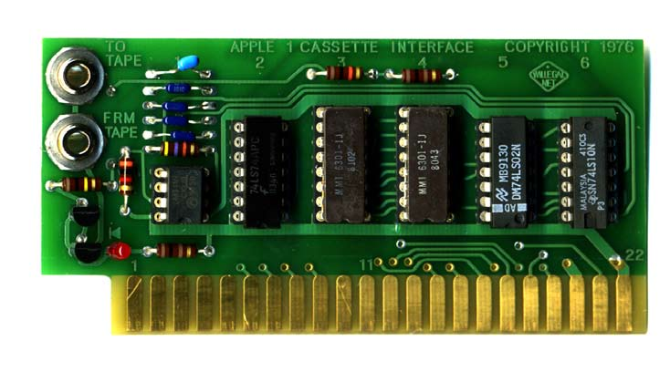
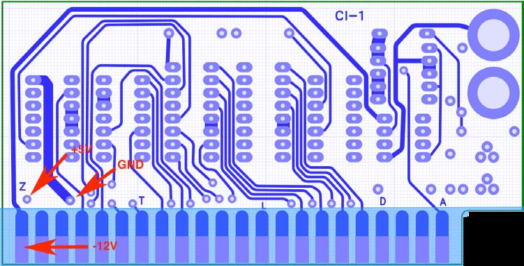
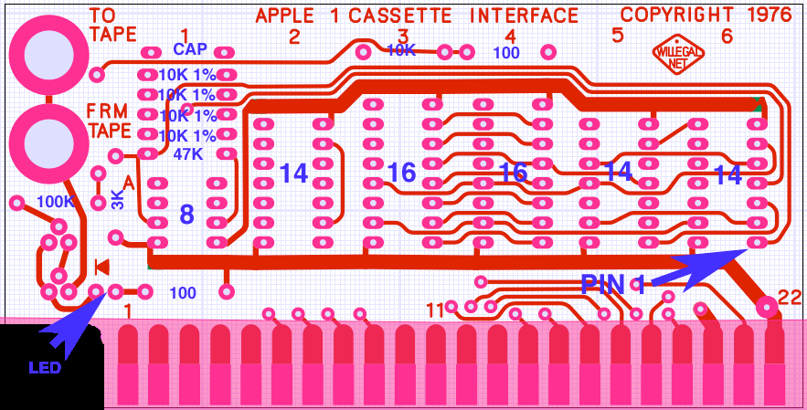
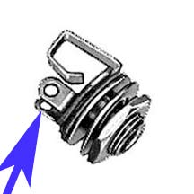
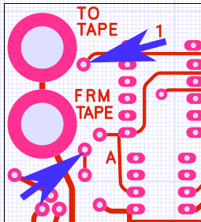

# Apple-1 Cassette Interface Assembly and Operations Guide

By Mike Willegal (www.willegal.net)

Version 0.18.1

Reformatted in Markdown and Edited for general projects by jgw4

> [!CAUTION]
> Incorrect assembly or connecting of the Mimeo Cassette Interface can cause fatal damage to the interface and/or the motherboard. Double and triple check your connections before powering on. Pay special attention to orien- tation of the card when you plug it into the motherboard’s expansion slot. Plugging it in backwards will result in damage to the card and/or motherboard.

## Forward
In the mid 1970’s, around the time the Apple 1 was developed, the only reasonably affordable interface for home computer hobbyist was repurposing an ordinary cassette recorder as a data storage device. Soon after the introduction of the Apple 1, Apple Computer released the Apple Cassette Interface (ACI) for the Apple 1. This small card had a list price of $75 and turned out to be the only peripheral card that Apple ever released for the Apple 1. The Mimeo Cassette Interface is a clone of Apple’s original ACI, duplicating the form, fit and function of the original ACI in exacting detail. This manual refers to the board as the ACI, since that is the name Apple used and for all intents and purposes the implementations and operation are identical.

## Reliability
Reliability of the ACI card, in it’s stock form, is not very good by 21st century standards. Apple made improvements to the cassette interface circuit when it came out with the Apple II. Willegal has spent considerable effort looking for improvements in reliability, without altering the design of the original ACI printed circuit board. In the end, he has found two items that can help with reliability:

1. Changing the value of the input coupling capacitor. Because of the reliability problems with the original design, it is recommended to build the ACI with components that improve reliability. The look and feel of the board is not affected but reliability is improved quite a bit. Even with these changes, reliability is not perfect, but the system will be more reliable.

2. Using an Apple recommended cassette recorder. Willegal has had great difficulty with a different vintage cassette recorder that works quite well with an Apple II. The good news is that a modern variation of the original Apple recommended recorder happens to remain on the market, the Panasonic RQ-2102. There may be other cassette recorders that perform as well or better than the RQ2102, but time or resources to investigate the possibilities have not been explored.

## Chapter 1: Assemble Components, Tools, and Equipment
### 1. Recommended Tools and Equipment
- Quality soldering station - a Weller WES51 is one recommendation. Whatever you use, it is recommended that it has some kind of temperature controlled tip. This will help prevent damage to the PCB when soldering. Soldering irons that do not have a temperature controlled tip can overheat and damage the PCB or component being soldered
- Solder - use quality solder - thinner solder is vastly easier to work with than fat solder. The fat stuff sold at hardware stores is not suitable for these sort of electronics projects
- Wire cutters – for trimming component leads and cutting wire to length
- Wire strippers - for stripping ends of jumper wire
- Your favorite PCB cleaning agent - Isopropyl Alcohol will dissolve many kinds of soldering resin. Windex will also help with cleaning PCBs
- Ohm meter - to check for good connections and shorts
- Logic probe or oscilloscope – handy if you are having trouble with bring up
- Your host computer schematics or hardware interfacing guide – Direction for connecting to Mimeo 1 computers are provided in this manual

### 2. Additional Components (not included)
-   Cassette Recorder - the Panasonic RQ-2102 is strongly recommended
-   Cassette Tapes - ordinary 30 or 60 minute tapes work well
-   Two mono to mono 1/8” audio cables. One end plugs into the ACI, the other into jacks on the cassette recorder
### 3. Bill of Materials

| Part | Description | Quantity |
| --- | --- | ---: |
| 16 pin socket | For PROMs | 2 |
| 14 pin socket | For 74LS parts | 3 |
| 8 pin socket | For LM311 | 1 |
| LM311 | Voltage comparator | 1 |
| 74LS02 | Quad 2 input nor gate | 1 |
| 74LS10 | Triple 3 input nand gate | 1 |
| 74LS74 | Dual D type flip flop | 1 |
| 7474 | no longer supplied - original 74LS74 works better | 1 |
| 6301 - APPLE-A3 | 256x4 PROM - location A3 | 1 |
| 6301 - APPLE-A4 | 256x4 PROM - location A4 | 1 |
| .01uF capacitor | Input coupling capacitor | 1 |
| .1uF capacitor | Reliability improvement replacement for .01uF | 1 |
| 100 ohm | brown-black-brown Low part of voltage divider for tape output & current limiter for LED input monitor | 2 |
| 3K resistor | orange-black-red Voltage comparator feedback | 1 |
| 10K resistor | brown-black-orange-gold High part of voltage divider for tape output | 1 |
| 10K 1% resistor | brown-black-orange-black-brown Voltage dividers for inputs to voltage comparator | 4 |
| 47K resistor | yellow-violet-orange Voltage comparator feedback | 1 |
| 100K resistor | brown-black-yellow Sense resistor for input monitor LED | 1 |
| PCB | Printed circuit board | 1 |
| MPS3704 | Sense transistors for input monitor LED | 2 |
| RED LED | Read level indicator | 1 |
| Audio Jacks | Switchcraft #41 | 2 |
| Jumper wire for jacks | Apple used bare wire - use cut lead from a resistor | 1 |
| PARTS COUNT |  | 32 |
| COUNT OF TYPES |  | 23 |
## Chapter 2 - Solder In Components
### 1. Overview

The key thing here is to check orientation and make sure that you don’t put the sockets or transistors in wrong. For the IC sockets, make sure that the parts are oriented correctly with pin 1 of the socket or chip near the edge of the PCB that contains the gold fingers. All components go on the front of the board (the side with the words “Apple Cassette Interface 1” etched in copper).

Make sure the socket or chip is fully seated. One recommended methed to accomplish this is by resting the socket upside down on a small object with the board on top. The weight of the board should keep the socket or chip completely seated. Then tack down a couple of corner pins and recheck orientation and seating. Then finish soldering the rest of the pins.

Take your time and enjoy the process, double checking orientation of devices as you go. The red or blue arrows indicate places to pay special attention when placing components.

back side of board

### 2. Check for Power and Ground Shorts on PCB

Easiest way to do this is to use an ohm-meter to make sure that there is no connection between +5 volts, -12 volts and ground. The Ohm meter should show no connections between any of these nets. A convenient place to use to check for shorts, is this area on the back of the board (red arrows above).

### 3. Solder in All Components Except 1/8” Phono Jacks

Front view of board (components are mounted on front side of board)

| Part | Description | Quantity |
| --- | --- | ---: |
| 16 pin socket | A-3 and A-4 - pin 1 toward gold finger edge | 2 |
| 14 pin socket | A-2, A-5, A-6 - pin 1 toward gold finger edge | 3 |
| 8 pin socket | A-1 - pin 1 toward gold finger edge | 1 |
| capacitor | Input coupling capacitor - topmost device in row of components at A-1. Use .1uF (104) capacitor for better read reliability. Use .01uF (103) capacitor to exactly replicate original design. | 1 |
| 100 ohm | brown-black-brown Top of row at A4 | 2 |
| 100 ohm | brown-black-brown Next to gold fingers in row A1 | 1 |
| 3K ohm | orange-black-red Vertically mounted - left of 8 pin dip in row A-1 | 1 |
| 10K resistor | brown-black-orange-gold Top of row at A-3 | 1 |
| 10K 1% resistor | brown-black-orange-black-brown Four in a row below cap in row A-1 | 4 |
| 47K resistor | yellow-violet-orange Just above 8 pin dip in row A-1. | 1 |
| 100K resistor | brown-black-yellow just below two 1/8” jacks | 1 |
| MPS3704 | Below two 1/8” jacks - flat side toward top of board (middle pin goes in hole closer to top of board) | 2 |
| RED LED | Long lead (anode) on right | 1 |

### 4. Install 1/8” Phono Jacks

After mounting the jacks, a short wire must be connected from tab on jack to PCB hole to connect read and write circuits to the jacks. See the illustrations above for locations.
| Part | Description | Quantity |
| --- | --- | ---: |
| Read and Write Jacks | The jack is mounted with the receptacle facing the front of the board (the same side as the components). Firmly tighten the nut, but not so tight that you risk damaging the PCB. Ground is through this connection. Use two short lengths of wire left over from cutting off resistor leads. They only need to be long enough to reach from the tab on jack to the hole in the PCB. Original ACIs had no insulation on these short lengths of wire. From the back of the board, solder one end to tab on jack and the other to the appropriate hole in the PCB. There are two tabs. Be sure to connect the wire to the tab that connects to the tip of the plug. | 2 |
### 5. Recheck for Power and Ground Shorts on PCB

Easiest way to do this is to use an ohm-meter to make sure that there is no direct connection between +5 volts, -12 volts and ground. With the resistors now soldered in, you should note about 9.6K ohms resistance between +5 volts and ground. -12 volts should have no connectivity with either +5 volts or ground.

### 6. Install ICs
| Part | Description | Quantity |
| --- | --- | ---: |
| LM311 | 8 Pin Socket at A-1. Pin 1 toward gold fingers | 2 |
| 74LS74 | 14 Pin Socket at A-2. Pin 1 toward gold fingers. | 1 |
| PROM A-3 | 16 Pin Socket at A-3. Pin 1 toward gold fingers. PROM is printed with “APPLE A-3” on top of the package and has an A3 label on the bottom. | 1 |
| PROM A-4 | 16 Pin Socket at A-4. Pin 1 toward gold fingers. PROM is printed with “APPLE A-4” on top of the package and has an A4 label on the bottom. | 1 |
| 74LS02 | 14 Pin Socket at A-5. Pin 1 toward gold fingers. | 1 |
| 74LS10 | 14 Pin Socket at A-6. Pin 1 toward gold fingers. | 1 |

### 7. Clean PCB of Rosin and By-products of Soldering
Once soldering is complete, clean the back of PCB of excess flux and rosin. 90% or higher isopropyl alcohol. IPA will dissolve soldering resin. Note that the IPA will also remove the APPLE-AX printing on the PROMs so keep it away from these parts. Spray it on the back of the board and lightly scrub with a very soft brush that will not scratch the surface of the PCB. Soak up the IPA and contaminates with a clean soft cloth before the IPA evaporates in order to remove the by products of soldering. It is also worth noting that “Windex” window cleaner can help remove the by-products from the soldering job. Removing contaminates is important as many kinds of rosins are corrosive. Let dry overnight. Position a fan to blow over the board to make sure that all remaining moisture evaporates.

### 8. Check Board for Solder Bridges and Cold Solder Joints
While the board is drying, you should carefully check your work for bad solder joints and solder bridges.

## Chapter 3 - Installation, Operation and Help

### 1. Installation and Operation

Completely read and understand the original Apple Cassette Interface Manual located at [`/doc/aciman.pdf`](../doc/aciman.pdf) for installation and operation instructions.

### 2. Troubleshooting and Help

A good job of soldering the components into place should eliminate most if not all trouble. First step, in case of trouble, should be to check for bad solder joints or bridges.

You can also refer to the Apple II repair page at www.willegal.net for some general troubleshooting hints.

## Appendix A - Using an MP3 Player With the ACI

An iPod may be used in place of a cassette player with the ACI. Almost any iPod can be used for loading programs with the same cable that is used for reading from a cassette player. Programs must be put into AIFF format prior to loading.

As far as is known, any Digital MP3 player can be used, as long as the program is in a lossless audio format, most commonly AIFF or WAV. iPods do not natively support WAV files so must be converted to AIFFs in this case.

There is a repository of software to choose from located in [`/software/`](../software/), and Willegal has listed several programs in AIFF format on this web page: http://www.willegal.net/appleii/apple1-software.htm

This same page has the source code for a UNIX shell program that will convert programs in Apple monitor format into AIFF files, so that you can convert your own programs to be loaded from a iPod.

Writing to the iPod requires an iPod that supports microphone input, a special cable and an iPad application that uses a lossless recording format. A detailed write up on the process can be found here.
http://www.apple1notes.com/Home/Notes.html

## Appendix B - Replica Project Compatibility with the ACI
At the time of this manual's writing, the ACI has not been tested with a Briel Computer Systems Replica 1.

The Achatz replica does not have a provision for -12 volts, so the ACI will not work with that system.

## Appendix C - Apple's Original ACI Manual Errata

Unlike what the manual indicates, performance with various cassette recorders can vary from not functional to works pretty well. A Panasonic RQ-2102 is recommended. The best volume setting for read operations on my recent production Panasonic RQ-2102 is around a 4.

The LED circuit is configured to turn on at about 1.2 volts, which is too high a level for reliable data recovery. Don’t rely on the LED to set your playback volume.

Finally, it is my opinion is that the reliability of the ACI is not as good as the manual suggests. In fact, with the stock .01uF capacitor in place, I have experienced very unreliable operation. Operation improves substantially with the .1uF capacitor, which is why I have included it in the kit. This is not unique to reproductions, as I know of an owner of an original Apple 1 that had to resort to bridging the existing .01uF cap with a .1uF cap before he could read files from an cassette player during his efforts to restore the unit to operation.

Except for these points, the manual contains accurate and useful information for installation and operation of the ACI and should be read and understood prior to installing and operating your ACI.

## Appendix D: ACI Source code

Source code for the 256 byte PROM bank that exists on the ACI card can be found at [`/fw/wozaci.asm`](../fw/wozaci.asm)